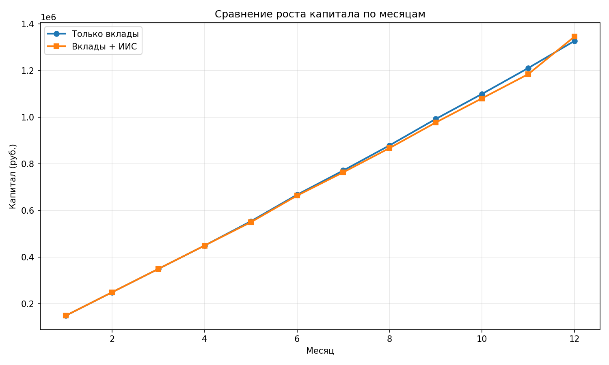
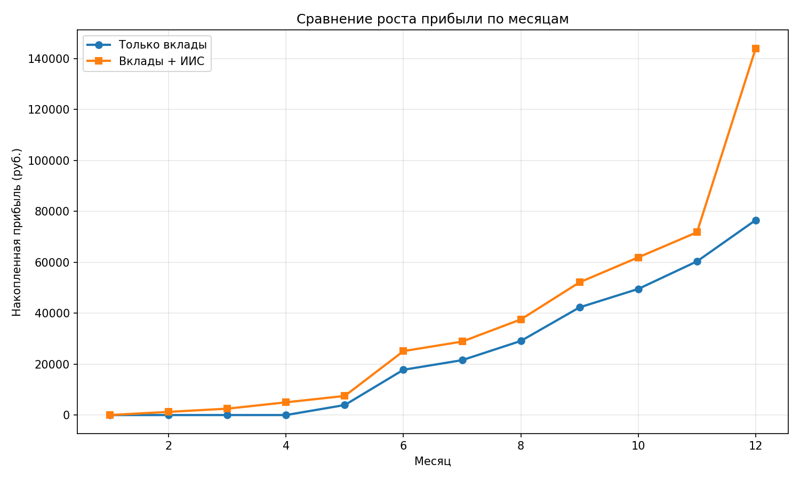

# Инвестиционный отчет: Сравнение стратегий

Дата генерации: 2026-01-01 17:05:16

## Стратегия 1: Только вклады

|   месяц |   вложено своих |   капитал на вкладах |   прибыль (выплаты) | ставка новых вкладов   |
|--------:|----------------:|---------------------:|--------------------:|:-----------------------|
|       1 |          150000 |     150000           |                0    | 16.0%                  |
|       2 |          250000 |     250000           |                0    | 15.7%                  |
|       3 |          350000 |     350000           |                0    | 15.4%                  |
|       4 |          450000 |     450000           |                0    | 15.1%                  |
|       5 |          550000 |     553925           |             3925    | 14.8%                  |
|       6 |          650000 |     667775           |            13850    | 14.5%                  |
|       7 |          750000 |     771550           |             3775    | 14.2%                  |
|       8 |          850000 |     879095           |             7545.23 | 13.9%                  |
|       9 |          950000 |     992285           |            13189.6  | 13.6%                  |
|      10 |         1050000 |          1.09952e+06 |             7234.01 | 13.3%                  |
|      11 |         1150000 |          1.21034e+06 |            10823.6  | 13.0%                  |
|      12 |         1250000 |          1.32656e+06 |            16219.4  | 12.7%                  |

## Стратегия 2: Вклады + ИИС с налоговым вычетом

|   Месяц |   Вложено своих |   На вкладах |   На ИИС (ОФЗ) |   Общий капитал |   Накопленная прибыль |
|--------:|----------------:|-------------:|---------------:|----------------:|----------------------:|
|       1 |          150000 |       150000 |              0 |          150000 |                     0 |
|       2 |          250000 |       150000 |         100000 |          250000 |                  1250 |
|       3 |          350000 |       250000 |         100000 |          350000 |                  2500 |
|       4 |          450000 |       250000 |         200000 |          450000 |                  5000 |
|       5 |          550000 |       350000 |         200000 |          550000 |                  7500 |
|       6 |          650000 |       363850 |         300000 |          663850 |                 25100 |
|       7 |          750000 |       463850 |         300000 |          763850 |                 28850 |
|       8 |          850000 |       467550 |         400000 |          867550 |                 37550 |
|       9 |          950000 |       577115 |         400000 |          977115 |                 52115 |
|      10 |         1050000 |       580665 |         500000 |         1080665 |                 61915 |
|      11 |         1150000 |       684268 |         500000 |         1184268 |                 71768 |
|      12 |         1250000 |       696964 |         648000 |         1344964 |                143964 |

## Итоги

- **Стратегия 1**: Вложено 1250000, Капитал 1326561.74, Общая прибыль 76561.74
- **Стратегия 2**: Вложено 1250000, Капитал 1344964, Общая прибыль 143964

## Дополнительные файлы

- CSV: (strategy_deposits.csv)[strategy_deposits.csv]
- CSV: strategy_fixed_iis.csv
- График капитала: capital_comparison.png
- График прибыли: profit_comparison.png
## Графики

### Сравнение капитала

### Сравнение прибыли

## Краткая сводка по стратегиям

- **Стратегия 1 (Только вклады)**: вложено 1250000, итоговый капитал 1326561.74, прибыль 16219.35, ROI 6.12%, CAGR 6.12%
- **Стратегия 2 (Вклады + ИИС)**: вложено 1250000, итоговый капитал 1344964, прибыль 143964, ROI 7.60%, CAGR 7.60%

## Анализ от AI

Проанализировав представленные данные по двум стратегиям, представляю выводы и рекомендации.

### 1. Какая стратегия предпочтительнее по итоговому капиталу и почему?

**Предпочтительнее Стратегия 2 (Вклады + ИИС).**

*   **Почему:** Она обеспечивает более высокую доходность при сопоставимом уровне кредитного риска (если внутри ИИС используются ОФЗ или корпоративные облигации высшего рейтинга). 
*   **Главный драйвер:** Дополнительная доходность в Стратегии 2 формируется за счет налоговых преимуществ ИИС (вычет типа А на взнос или освобождение от налога на доход типа Б). Это позволяет «обогнать» обычный депозит, доходность которого ограничена рыночной ставкой и налогом на превышение необлагаемого лимита.

### 2. Абсолютная и относительная разница в прибыли

*   **Абсолютная разница:** 18 402,26 руб. (1 344 964 - 1 326 561,74).
*   **Относительная разница по капиталу:** Стратегия 2 эффективнее Стратегии 1 на **1,39%** по суммарному итогу.
*   **Относительная разница по чистой прибыли:** 
    *   Прибыль Стр. 1: 76 561,74 руб.
    *   Прибыль Стр. 2: 94 964 руб.
    *   **Разница в прибыли:** Стратегия 2 принесла на **~24% больше чистой прибыли**, чем стратегия только с вкладами.

### 3. Ключевые риски

**Стратегия 1 (Только вклады):**
*   **Риск ликвидности (Средний):** При досрочном расторжении вклада обычно теряются все накопленные проценты.
*   **Процентный риск (Высокий):** Если ставки в экономике вырастут, вы «заперты» в старом вкладе с низкой ставкой.
*   **Налоговый риск:** Существует налог на процентный доход (13-15% с суммы, превышающей лимит), что снижает реальный CAGR.

**Стратегия 2 (Вклады + ИИС):**
*   **Риск ликвидности (Высокий):** ИИС (особенно нового типа ИИС-3) предполагает заморозку средств на срок от 5 лет. Досрочное закрытие приведет к необходимости вернуть налоговые вычеты и уплатить пени.
*   **Регуляторный риск:** Изменение законодательства по ИИС (уже произошло разделение на старые и новые типы).
*   **Рыночный риск:** Если внутри ИИС куплены облигации, их цена может упасть при росте ключевой ставки (текущая ситуация на рынке РФ).

### 4. Рекомендованные улучшения и альтернативы

1.  **Фонды денежного рынка (LQDT и аналоги):** Вместо части вкладов использовать инструменты с доходностью, привязанной к ставке ЦБ. Это дает ликвидность "день в день" без потери доходности.
2.  **Лестница вкладов/облигаций:** Разбить сумму на части с разными сроками погашения (3, 6, 9 месяцев), чтобы иметь доступ к кэшу и возможность переложиться под более высокий процент.
3.  **Использование ОФЗ-ПК (флоатеров):** Внутри ИИС покупать облигации с переменным купоном. Это защитит капитал от падения цены при росте ключевой ставки.
4.  **Максимизация вычета:** Убедиться, что сумма взноса на ИИС соответствует вашему официальному годовому доходу (НДФЛ), чтобы полностью забрать вычет 13% (до 52 000 руб.).

### 5. Итоговая рекомендация (горизонт — 1 год)

Если ваша цель — **максимальная капитализация строго через один год** и вам могут понадобиться эти деньги в конце срока:

*   **Если ИИС уже открыт более 2 лет назад:** Используйте **Стратегию 2**. Вы сможете закрыть его через год (по истечении 3-летнего срока для ИИС старого типа) и забрать повышенную прибыль.
*   **Если ИИС нужно открывать сейчас:** Будьте осторожны. По закону (ИИС-3) вы не сможете вывести деньги через год без потери льгот. В этом случае **Стратегия 2 превращается в Стратегию 1**, но с большими комиссиями брокера и риском просадки цен облигаций.

**Вердикт:** Для горизонта ровно в 1 год при отсутствии открытого ранее ИИС, выбирайте **Стратегию 1**, но замените обычные вклады на **накопительные счета** (первые 2-3 месяца часто дают промо-ставку выше вклада) или **короткие облигации (ОФЗ)**, чтобы зафиксировать текущую высокую доходность.
